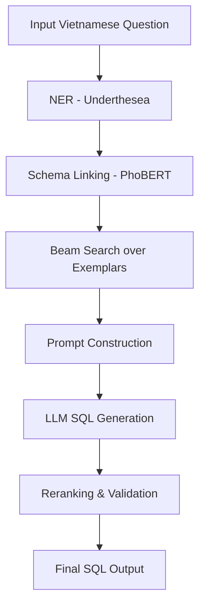

# 🐍 ViPERSQL: Vietnamese Prompting with Entity-aware Retrieval for Text-to-SQL

A comprehensive framework for Vietnamese Text-to-SQL with advanced prompting strategies and evaluation tools.

## 📌 Problem Statement

**NL2SQL** (Natural Language to SQL) is the task of translating natural language questions into executable SQL queries over relational databases. While this task has been extensively studied in English, it remains underexplored for **Vietnamese**, due to:

- The lack of large-scale Vietnamese NL2SQL datasets.
- Limited availability of schema-aware tools for Vietnamese (e.g., NER, linking).
- Poor generalization of English-centric LLMs to low-resource languages.

---

## 📚 Dataset Overview

We use **ViText2SQL**, the first Vietnamese Text-to-SQL dataset introduced in EMNLP 2020:  
📄 [Link to paper](https://aclanthology.org/2020.findings-emnlp.364.pdf)

### Dataset Statistics
- **Total samples**: 9,693 question-SQL pairs
- **Databases**: 166 unique databases  
- **Data splits**: 
  - Train: 6,831 samples (70.5%)
  - Dev: 954 samples (9.8%) 
  - Test: 1,908 samples (19.7%)

### Versions Available
- **Syllable-level**: Tokenized at syllable level for Vietnamese
- **Word-level**: Tokenized at word level

### Query Complexity Distribution
- **Easy (39.5%)**: Simple SELECT queries with basic WHERE conditions
- **Medium (13.5%)**: Queries with GROUP BY, ORDER BY, or simple JOINs
- **Hard (36.5%)**: Complex JOINs with aggregations
- **Extra (10.5%)**: Nested queries, UNION, or multiple complex operations

---

## 💡 Proposed Method: ViPERSQL

**ViPERSQL** is a lightweight, training-free framework for Vietnamese NL2SQL, combining:

- **In-Context Learning (ICL)** with intelligent exemplar selection
- **Named Entity Recognition (NER)** for Vietnamese schema linking
- **Schema linking** via embeddings and similarity matching
- **Beam Search–based** exemplar retrieval for optimal few-shot examples

The goal is to build high-quality prompts with few-shot examples tailored to each question without fine-tuning the LLM.

### 🔷 1. Named Entity Recognition (NER)
- Use the `underthesea` library to extract entities (table names, column names, values) from the input question.
- Helps identify relevant schema components for SQL construction.

### 🔷 2. Schema Linking via Embedding Similarity
- Apply **PhoBERT** to encode both entity spans and schema elements.
- Use **cosine similarity** to determine which tables/columns are most likely referenced in the question.

### 🔷 3. Beam Search for Exemplar Selection
- For each test question, search the training set to find the top-k relevant exemplars using beam search.
- Selection criteria:
  - Entity overlap (NER + embedding similarity)
  - Structural similarity (SQL clause patterns: SELECT, WHERE, etc.)

### 🔷 4. Prompt Construction
- A complete prompt includes:
  - Naturalized schema context (or raw schema)
  - k few-shot examples (Vietnamese question + SQL)
  - The test question

### 🔷 5. SQL Generation via LLM
- Use GPT-4, Claude, or another LLM to generate SQL queries from the constructed prompt.
- Optionally apply **beam decoding** to generate multiple candidates.

### 🔷 6. Reranking & Output Selection
- Select the best candidate based on:
  - Entity coverage (matching schema elements)
  - Execution correctness (if database is available)
  - Model confidence (logprobs or internal reranker)

---

## 🛠️ Pipeline Overview



---

## 🚀 MINT Evaluation Toolkit

This repository includes **MINT** (Modern Integration for Natural language Text-to-SQL), a comprehensive evaluation toolkit specifically designed for Vietnamese Text-to-SQL models.

### Key Features
- **SQLite Database Creation**: Automatically generate executable databases from metadata
- **SQL Query Execution**: Safe execution with timeout protection and result comparison
- **Comprehensive Metrics**: Exact match, component-wise accuracy, execution accuracy, difficulty analysis
- **Vietnamese Support**: Proper handling of Vietnamese characters and text

### Quick Start with MINT

```python
from mint import SQLiteBuilder, SQLExecutor, EvaluationMetrics

# Build databases
builder = SQLiteBuilder()
builder.build_all_databases("dataset/ViText2SQL")

# Execute and compare queries
executor = SQLExecutor()
metrics = EvaluationMetrics()

# Evaluate your model
results = metrics.comprehensive_evaluation(predicted_queries, gold_queries)
print(metrics.evaluation_summary(results))
```

See `mint/README.md` for detailed documentation and examples.

---

## 📁 Dataset Structure

```
dataset/ViText2SQL/
├── syllable-level/
│   ├── train.json         # Training data (6,831 samples)
│   ├── dev.json           # Development data (954 samples)
│   ├── test.json          # Test questions (1,908 samples)
│   ├── test_gold.sql      # Test gold SQL queries
│   └── tables.json        # Database schema metadata
└── word-level/
    ├── train.json         # Training data (6,831 samples)
    ├── dev.json           # Development data (954 samples)
    ├── test.json          # Test questions (1,908 samples)
    ├── test_gold.sql      # Test gold SQL queries
    └── tables.json        # Database schema metadata
```

---

## 🔧 Getting Started

### Prerequisites
- Python 3.8+
- Virtual environment (recommended)

### Installation

```bash
# Clone the repository
git clone https://github.com/your-username/ViPERSQL.git
cd ViPERSQL

# Create and activate virtual environment
python -m venv venv
source venv/bin/activate  # On Windows: venv\Scripts\activate

# Install dependencies
pip install pandas numpy matplotlib seaborn plotly sqlparse jupyter
pip install underthesea transformers torch sentence-transformers
```

### Basic Usage

1. **Load the dataset**:
```python
import json

# Load training data
with open('dataset/ViText2SQL/syllable-level/train.json', 'r', encoding='utf-8') as f:
    train_data = json.load(f)

print(f"Training samples: {len(train_data)}")
```

2. **Run ViPERSQL pipeline**:
```python
from vipersql import ViPERSQL

# Initialize the framework
viper = ViPERSQL(
    dataset_path="dataset/ViText2SQL/syllable-level/",
    model_name="gpt-4"
)

# Generate SQL for a Vietnamese question
question = "Tìm tên và tuổi của tất cả học sinh trong lớp 10A"
sql_query = viper.generate_sql(question, db_id="school")
print(f"Generated SQL: {sql_query}")
```

3. **Use MINT for evaluation**:
```python
from mint import SQLiteBuilder, EvaluationMetrics

# Create databases for testing
builder = SQLiteBuilder()
builder.build_all_databases("dataset/ViText2SQL")

# Evaluate model predictions
metrics = EvaluationMetrics()
results = metrics.comprehensive_evaluation(predicted_queries, gold_queries)
```

---

## 📈 Performance Analysis

### Language Characteristics
- **Syllable vs Word tokenization**: 1.26x length ratio
- Vietnamese-specific challenges: Word segmentation, tone marks
- Domain coverage: Various database schemas and question types

### SQL Features
- **43.6%** of queries contain JOINs
- **25.3%** have complex WHERE clauses  
- **57.6%** use WHERE conditions
- Average query length: 19.2 tokens

---

## 🎯 Research Applications

### Applications of ViPERSQL
1. **Schema Linking**: Enhanced Vietnamese text-database linking with PhoBERT
2. **Exemplar Selection**: Intelligent few-shot example retrieval
3. **Cross-lingual Transfer**: Leverage English knowledge for Vietnamese
4. **Error Analysis**: Comprehensive analysis across query difficulties

### Evaluation Metrics
1. **Exact Match**: Perfect SQL string matching
2. **Execution Accuracy**: Verify correctness through query execution
3. **Component Analysis**: Evaluate individual SQL components (SELECT, WHERE, etc.)
4. **Difficulty Analysis**: Performance breakdown by query complexity

---

## 📚 Citation

If you use this framework or dataset in your research, please cite:

```bibtex
@inproceedings{nguyen-etal-2020-pilot,
    title={A Pilot Study of Text-to-SQL Semantic Parsing for Vietnamese},
    author={Nguyen, Anh Tuan and Nguyen, Mai Hoang Dao and Nguyen, Dat Quoc},
    booktitle={Findings of the Association for Computational Linguistics: EMNLP 2020},
    year={2020},
    publisher={Association for Computational Linguistics}
}
```

---

## 🤝 Contributing

We welcome contributions to improve the framework and tools:

1. Fork the repository
2. Create a feature branch
3. Make your changes
4. Submit a pull request

---

## 📄 License

This project is licensed under the MIT License - see the LICENSE file for details.

---

## 🔗 Links

- **Paper**: [A Pilot Study of Text-to-SQL Semantic Parsing for Vietnamese](https://aclanthology.org/2020.findings-emnlp.364.pdf)
- **MINT Documentation**: See `mint/README.md` for detailed toolkit documentation
- **Issues**: Please report issues through GitHub Issues

---

## 🙏 Acknowledgments

- Vietnamese Text-to-SQL research community
- Contributors to the ViText2SQL dataset
- Open source libraries: underthesea, transformers, PhoBERT
- OpenAI GPT-4 and Anthropic Claude for LLM capabilities